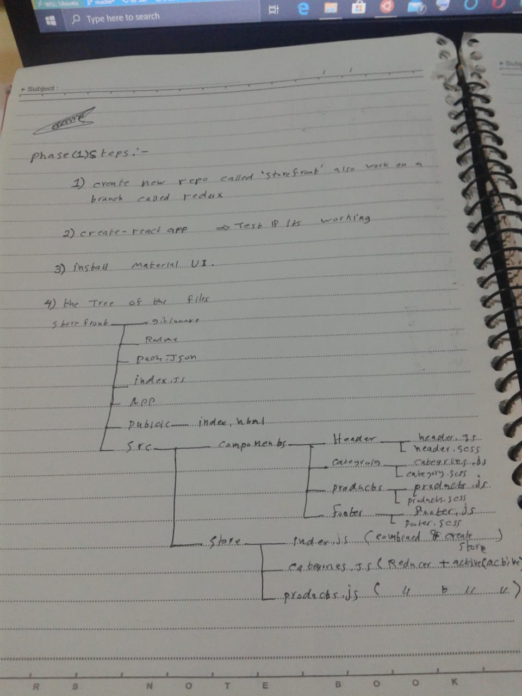
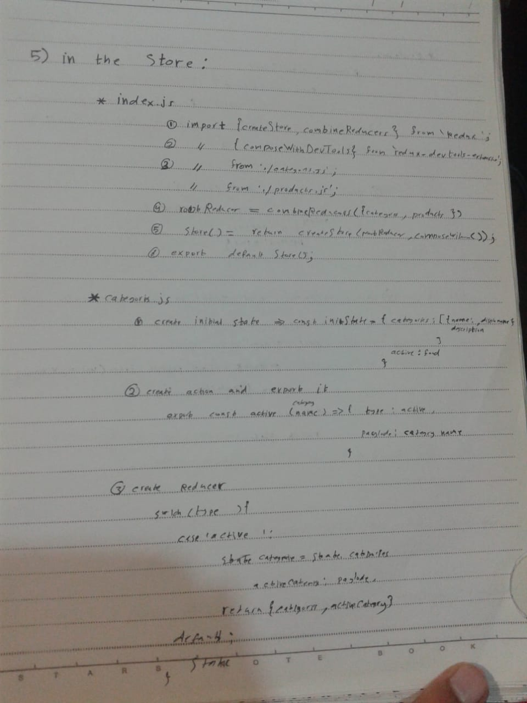
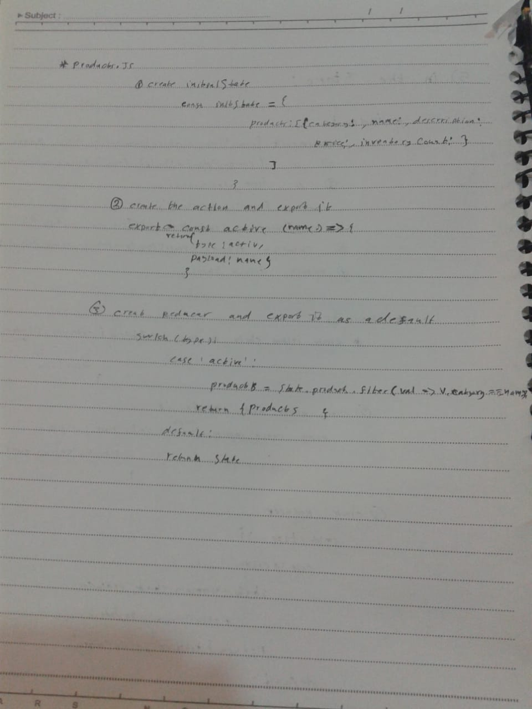
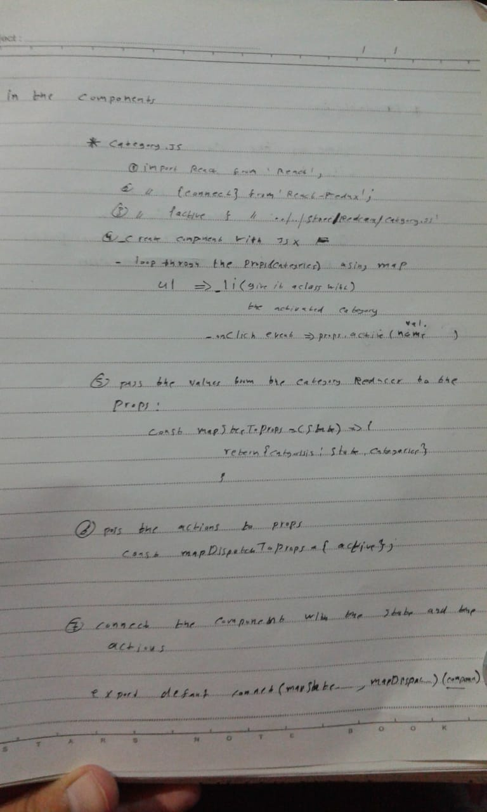
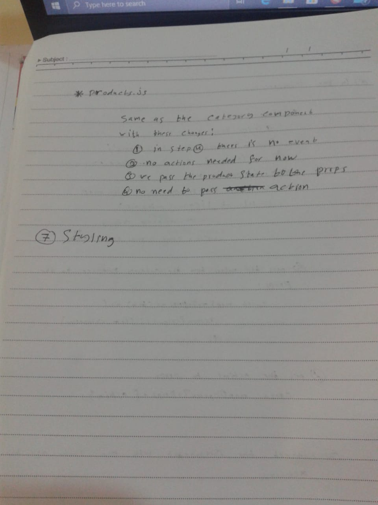

# Store Front 

## Author: Yasmin Aladailah - Osama Mousa 

## Links 
  [LAB-36 PR](https://github.com/401-advanced-javascript-osama/storefront2/pull/1)

## How to initialize the application
    `npm run start`
## deplyed url 
[Netlify](https://dreamy-pike-c56e6b.netlify.app/)
## Modules
  - Header.js
  - Footer.js
  - Categories.js
  - Products.js
  - App.js
  - Index.js

## UML  

